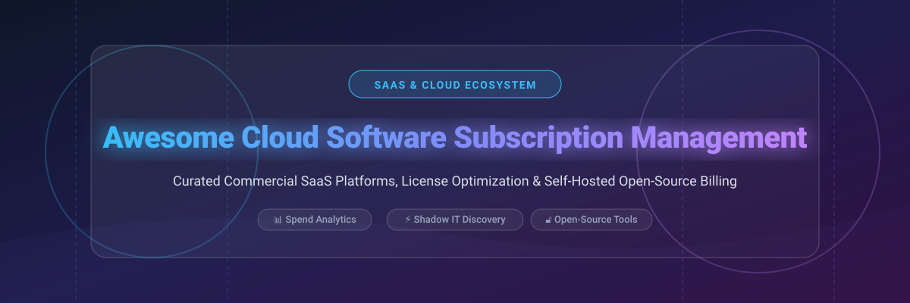

# Awesome-Cloud-Software-Subscription-Management 📋 💳

  

  
  
  
  
  
  

---

## 🌟 Top Cloud Software Subscription Management Ecosystem 📊

**Curated List of Commercial SaaS Management Platforms & Open-Source Subscription Tools**  
*Focused on SaaS Discovery, License Optimization, Renewal Management, Shadow IT Detection, Usage Metering & Self-Hosted Subscription Tracking*

**Last updated: October 2026** 📅

---

### 📌 Overview & SEO Summary 🔍

Welcome to the definitive curated directory of **cloud software subscription management platforms**, **enterprise SaaS spend optimization tools**, and **self-hostable open-source billing & subscription frameworks**. 

Managing cloud subscriptions and software licenses has become a strategic priority for IT administrators, FinOps engineers, and Finance teams worldwide. As organizations adopt hundreds of cloud services, unmanaged SaaS proliferation leads to hidden costs, redundant toolsets, security compliance risks, and unmonitored shadow IT. 

This guide categorizes leading commercial enterprise SaaS platforms (such as *Zylo*, *Productiv*, and *Torii*), cloud marketplace billing solutions (such as *AWS Marketplace Subscriptions*), procurement negotiation services (like *Vendr*, *Tropic*, and *Vertice*), as well as open-source subscription trackers and metering engines (such as *Wallos*, *Lago*, *Kill Bill*, and *InvoicePlane*).

**Key Market Context:**
- 💸 **SaaS Spend Optimization**: Industry reports show that organizations waste approximately **30% of their total SaaS expenditure** on inactive, duplicate, or unassigned software licenses.
- 🛡️ **Shadow IT & Compliance**: Enterprise SaaS management tools detect unauthorized application adoption across OAuth logins, SSO identity providers, and corporate credit card expense feeds.
- 🔓 **Self-Hosted Subscription Governance**: Open-source solutions like **Wallos** (5.8k+ stars) and **Lago** (6.2k+ stars) provide privacy-first subscription tracking and developer-friendly meter-based billing architectures.

---

## 📑 Table of Contents 📖

- [🏢 SaaS & Commercial Platforms](#-saas--commercial-platforms)
- [🔓 Open-Source GitHub Projects](#-open-source-github-projects)
- [🛠️ How to Contribute](#%EF%B8%8F-how-to-contribute)
- [📊 Star History](#-star-history)
- [🤝 Support & Sponsorship](#-support--sponsorship)
- [⚠️ Disclaimer](#%EF%B8%8F-disclaimer)

---

## 🏢 SaaS / Commercial Platforms 💼

> 📈 **Market Size & Industry Dynamics:** The global SaaS Management Platform (SMP) and subscription software market is estimated at **$3.5 Billion in 2026** and is projected to reach **$10.8 Billion by 2032**, growing at a CAGR of 20.4%. The market is **moderately fragmented**, featuring specialized sub-sectors: high-end discovery & shadow IT governance (Zylo, Productiv, Torii), procurement negotiation & purchasing (Vendr, Tropic, Vertice), SMB card controls (Cledara), and cloud provider consolidated billing dashboards (AWS Marketplace).

*Sorted by Company Valuation / Revenue (Descending)* 📊

| SaaS / Commercial Platform | Company / Owner | Market Size / Valuation / Revenue | Standard Edition Starting Price | Free Tier / Free Trial Limits | Description |
| :--- | :--- | :--- | :--- | :--- | :--- |
| **[AWS Marketplace Subscriptions](https://aws.amazon.com/marketplace/)** ☁️ | Amazon | ~$2.0 Trillion (Market Cap) | **$0 / month** (Consolidated AWS billing) | **Free forever** (No platform fees; pay only for underlying SaaS usage) | **AWS-native cloud subscription manager** — Consolidated monthly billing across AWS invoices, private catalog controls, automated procurement APIs, and unified software licensing governance. |
| **[Productiv](https://productiv.com/)** 🎯 | Productiv | ~$1.0 Billion (Valuation) | **$25,000 / year** (Base tier) | **14-day free trial** (Includes demo environment and sample SSO integration) | **SaaS engagement & license governance** — Real-time app usage analytics, automated license provisioning/deprovisioning, contract renewal forecasting, and deep Okta/Google Workspace integrations. |
| **[Zylo](https://zylo.com/)** 📊 | Zylo | ~$500 Million (Valuation) | **$50,000 / year** (Based on employee tier) | **30-day guided evaluation** (Requires executive briefing & data connection) | **Enterprise SaaS management platform** — Discovery engine via financial expense feeds, shadow IT audit, SaaS benchmarking database, and automated renewal workflows. |
| **[Vendr](https://www.vendr.com/)** 💰 | Vendr | ~$1.0 Billion (Valuation) | **$36,000 / year** (Standard tier) | **Free tier available** (Basic price intelligence lookup for up to 3 SaaS tools) | **SaaS buying & contract negotiation** — Guaranteed SaaS cost savings, transparent peer pricing data, automated procurement workflows, and vendor negotiation support. |
| **[Tropic](https://www.tropicapp.io/)** 📈 | Tropic | ~$700 Million (Valuation) | **$15,000 / year** (Starter plan) | **14-day free trial** (Access to vendor intelligence and contract repository) | **Intake & SaaS procurement platform** — Automated approval matrix, AI contract parsing, renewal alerts, vendor risk assessment, and spend management. |
| **[Torii](https://www.toriihq.com/)** 🔄 | Torii | ~$300 Million (Valuation) | **$8,000 / year** (Up to 200 users) | **14-day free trial** (Full feature access with up to 5 integrations) | **SaaS management automation** — Continuous app discovery, automated IT onboarding/offboarding workflows, shadow IT detection, and SaaS renewal tracking. |
| **[Vertice](https://www.vertice.one/)** 🔍 | Vertice | ~$250 Million (Valuation) | **$12,000 / year** (Platform access) | **14-day free trial** (Includes initial SaaS stack audit report) | **SaaS & cloud spend optimization** — Benchmark pricing insights, automated vendor renewals, contract management, and cloud infrastructure cost control. |
| **[Cledara](https://www.cledara.com/)** 💳 | Cledara | ~$100 Million (Valuation) | **$99 / month** (Up to 20 users) | **14-day free trial** (Includes virtual card issuance setup) | **SaaS management for growing teams** — Virtual card controls per subscription, automated invoice capture, approval workflows, and subscription cancellation enforcement. |
| **[NachoNacho](https://nachonacho.com/)** 🌮 | NachoNacho | ~$30 Million (Valuation) | **$29 / month** (Basic business plan) | **Free forever plan** (Manage up to 5 subscriptions with virtual cards) | **SaaS marketplace & subscription control** — Group buying discounts up to 30%, single-use virtual cards for software subscriptions, and consolidated spend tracking. |

---

## 🔓 Open-Source GitHub Projects 🚀

*Sorted by GitHub Stars Count (Descending)* 🌟

- **[Lago](https://github.com/getlago/lago)**   
  **Open-source metering and usage-based billing platform**, AGPL-3.0 licensed. **6.2k+ GitHub stars**. Flexible architecture supporting subscription plans, usage-based metering, hybrid pricing, REST APIs, and native Stripe/Adyen billing integrations. 🦭

- **[Wallos](https://github.com/ellite/Wallos)**   
  **Open-source personal & SMB subscription tracker**, GPL-3.0 licensed. **5.8k+ GitHub stars**. Features multi-currency support (40+ currencies), automatic exchange rate conversion, email renewal alerts, spending category analytics, and lightweight Docker container setup. 📊

- **[Kill Bill](https://github.com/killbill/killbill)**   
  **Enterprise open-source subscription billing & payment platform**, Apache-2.0 licensed. **5.1k+ GitHub stars**. Java-based pluggable engine for subscription lifecycle management, recurring invoices, complex catalog rules, and gateway integrations. 💰

- **[InvoicePlane](https://github.com/InvoicePlane/InvoicePlane)**   
  **Open-source client invoicing & recurring subscription system**, MIT licensed. **2.7k+ GitHub stars**. PHP-based self-hosted application for managing customer subscriptions, generating automated recurring invoices, and tracking payments. 📄

- **[SubTrackr](https://github.com/Ashfaaq98/SubTrackr)**   
  **Go-based subscription & expense tracking REST API**, MIT licensed. **320+ GitHub stars**. Developer-focused microservice featuring JWT authentication, full CRUD operations for recurring expenses, PostgreSQL backend, and Docker deployment. 🔧

- **[Subscriptions Manager](https://github.com/bmuschko/subscriptions-manager)**   
  **CLI tool to keep track of software subscriptions**, Apache-2.0 licensed. **180+ GitHub stars**. Lightweight command-line application built in Go for developer-centric subscription inventory and cost tracking. 🖥️

- **[subtracker](https://github.com/markdouthwaite/subtracker)**   
  **Minimalist subscription tracking utility**, MIT licensed. **95+ GitHub stars**. Focused open-source utility for managing recurring personal and cloud software expenses cleanly via terminal interface. 📋

---

## 🛠️ How to Contribute 🤝

Contributions are welcome! Follow these steps to submit new subscription management platforms or open-source software:

1. 🍴 **Fork** the repository.
2. 📝 **Add/edit** entries in `README.md` maintaining table/list structure and formatting.
3. 🔗 Include project title, official website/GitHub link, exact Stars Count, license, and brief description.
4. 🚀 Submit a **Pull Request** with a descriptive summary of your changes.

---

## 📊 Star History 📈

---

## 🤝 Support & Sponsorship 💖

If you find this cloud software subscription management repository useful, please consider supporting the project:

- ⭐ **Star** this repository to increase visibility!
- 🔀 **Fork** and share with fellow IT administrators, FinOps practitioners, and open-source advocates.
- ☕ **Sponsor & Buy Me a Coffee**: Support ongoing open-source curation via the [GitHub Sponsor Dashboard](https://github.com/sponsors/ishandutta2007).

---

## ⚠️ Disclaimer ℹ️

- This is a **community-curated** list — not exhaustive and not an endorsement. ℹ️
- **SaaS management platforms vary significantly in pricing** — **Zylo** starts at **$50,000/year**, **Productiv** at **$25,000/year**, **Torii** at **$8,000/year**, and **Cledara** at **$99/month**. Choose based on company size and whether you need discovery, optimization, or procurement negotiation.
- **AWS Marketplace Subscriptions is free of platform charges** — it provides consolidated billing and subscription visibility for marketplace purchases.
- **Open-source tools (Wallos, Lago, Kill Bill) require self-hosting** — **Wallos** runs via Docker container, **Lago** utilizes microservices, and **Kill Bill** requires Java application runtime. Always conduct a proof-of-concept before production deployment. 📋

---

  <b>Made with ❤️ for IT administrators, finance teams, and open-source subscription management advocates.</b>

